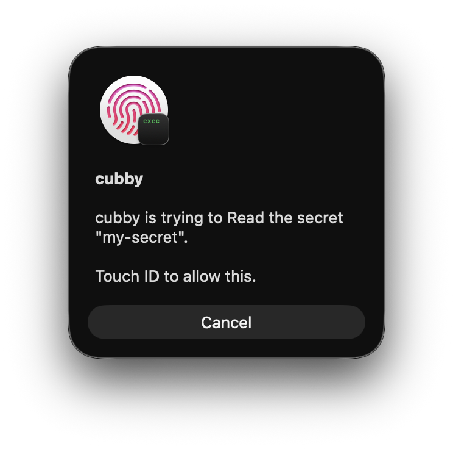

# cubby

[](https://github.com/koki-develop/cubby/releases/latest)
[](https://github.com/koki-develop/cubby/actions/workflows/ci.yml)
[](./LICENSE)

A macOS CLI that keeps secrets on disk, encrypted under a Secure Enclave key gated by Touch ID.

Every save and every read costs one Touch ID prompt.



## Requirements

- macOS 14 or later, on Apple silicon
- Touch ID enrolled

## Installation

```sh
brew install koki-develop/tap/cubby
```

## Usage

Create the store once:

```sh
cubby init
```

Save a secret. The value is read from the terminal with echo off:

```sh
cubby set my-secret
cubby set my-secret --from-stdin  # read the value from standard input instead
cubby set my-secret --force       # replace the value already stored
```

Read one back:

```sh
cubby get my-secret
```

List and delete:

```sh
cubby list
cubby rm my-secret
```

## How it works

The store's key is a P-256 key generated inside the Secure Enclave, and it never leaves it. `key.blob` holds a wrapped form that only that same enclave can turn back into a usable key, so a copy of the store is inert on any other Mac. Using the key takes Touch ID, with no password fallback.

`cubby set` seals the value with HPKE (P-256 / SHA-256 / AES-GCM-256) under that key and writes it to `secrets/<hex>.bin`; `cubby get` opens it again.

Each record carries the name it was sealed under, so a record copied to another name no longer opens, and one altered on disk is refused rather than decrypted into something else.

The store lives at `~/.cubby`, or at `$CUBBY_HOME` when that is set:

```
~/.cubby/                (0700)
├── key.blob             wrapped Secure Enclave key   (0600)
└── secrets/
    └── <hex>.bin        one secret                   (0600)
```

`<hex>` is the name in hex: the file system never sees a character you typed.

## License

[MIT](./LICENSE)
